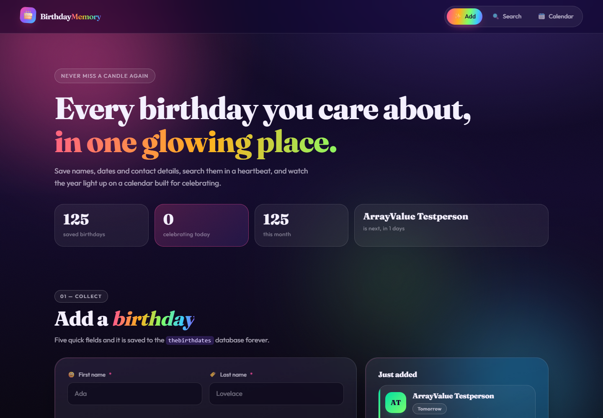
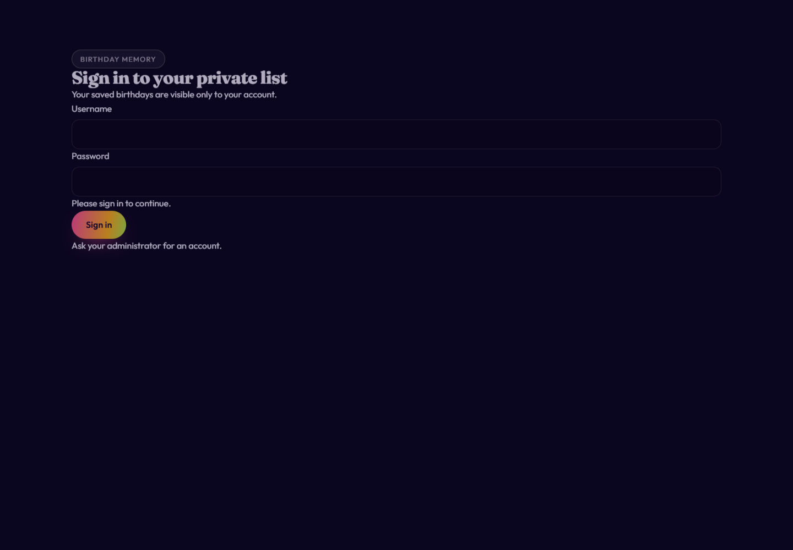
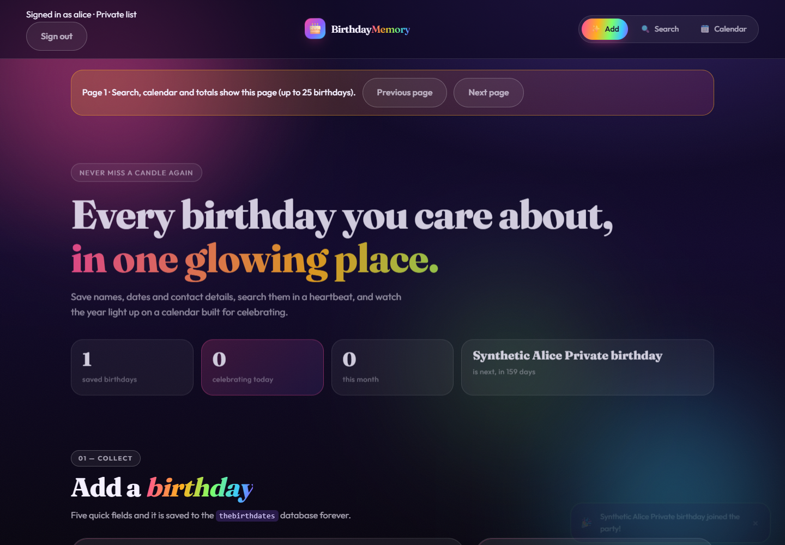
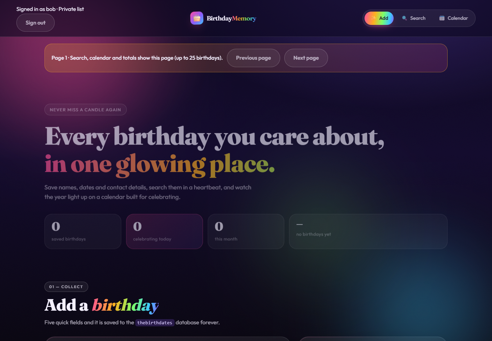

# Operation Candlelight

Birthday Memory: application security assessment and remediation

Bryan GurrCYBR-4550 - M5: Exploring Bad CodeTrack B - Application Security

September 21, 2026 (Mountain Daylight Time)Version 1.3Classification: PUBLIC - synthetic lab data only

Assessment boundary: my own fork, localhost/127.0.0.1 and locally owned Docker containers. No public vulnerable deployment or third-party testing.

Release opinion: suitable for a controlled local demonstration; no public production release until the operating controls in this report are verified.

Fork: alrightalrightalright/cyber-uvu-student-projectsBranch: security-hardening-appsecProject: cybr-4550/threat_actors/birthday_memory

Baseline: 849911e | Pre-remediation threat model: c146613Implemented application: fc41f5b; subsequent evidence and documentation commits preserve the tested behavior.

# Executive summary

The original Birthday Memory application let anyone who could reach it read, change and delete the birthday list without signing in. Local tests confirmed each action using fictional records. If deployed with real information, the same behavior could expose contact details, support targeted scams and leave the owner unable to trust the list.

The revised application requires sign-in and keeps each person's list private. Tests confirmed that a user can manage their own records while another user cannot see, change or delete them. The application now connects securely to its database, has fewer administrative powers and keeps a lasting record of changes. Limits on requests and data entry reduce opportunities for disruption.

All 23 groups of automated checks passed. Separate browser checks confirmed the normal sign-in and private-list experience. A deliberately weakened copy failed the access check, showing that the test can detect that mistake. An encrypted backup was successfully restored and matched the original data. Software scans found fewer known problems after unused utilities were removed, but a clean scan cannot establish that a system is safe.

Decision: approve the controlled local demonstration; do not approve a public release. Protection of the live storage has been specified but not verified. Backup keys remain on the same computer as the data. Secure public browser connections, account recovery and independent monitoring still need verification. Someone with control of the host computer remains able to reach sensitive information.

Before real information is accepted, budget about one to two working days to verify secure browser connections, encrypted storage and separately protected recovery keys. Account and monitoring procedures need a further two to four days, followed by one to two days of independent review. These are planning estimates for a small experienced team; costs depend on staffing and the chosen hosting arrangement. The remaining work should be approved and assigned before launch.

All assessment records were fictional. This work found weaknesses in a local teaching application; it did not identify a real personal-data breach.

# Contents

Section | Page
--- | ---
Executive summary | 2
Scope, method and evidence boundaries | 4
Architecture and trust boundaries | 5
Assets and STRIDE analysis | 6
Risk method and prioritized findings | 7
F1: identity and private records | 8
F2: database trust and permissions | 9
F7: storage and recoverability | 10
F3: input and browser defenses | 11
F4: bounded work and error handling | 12
F5: accountable changes | 13
F6: containers and software inventory | 14
Verification and negative results | 15
Conditional legal and regulatory analysis | 16
Roadmap and effort estimates | 17
Ship / no-ship opinion | 18
Appendix A: original and login views | 19
Appendix B: private-list views | 20
Appendix C: selected raw evidence | 21
Appendix D: technical sources | 22
Appendix D: legal sources and evidence | 23
Appendix E: AI disclosure | 24
Appendix F: browser response headers | 25
Appendix F: API headers and pairing | 26
Appendix G: complete evidence package | 27

The main report occupies pages 1-18. Appendices begin on page 19 and are excluded from the assignment page limit. Full transcripts and raw tool files are included in the embedded evidence archive described in Appendix G.

# Scope, method and evidence boundaries

## Authorized scope

Testing covered the owned local Birthday Memory client, API and database using fictional contact records. Unrelated coursework was excluded from application testing; the secret sweep covered the whole fork. Each account may manage only its own birthdays.

## Assessment framework and sequence

OWASP WSTG v4.2 guided configuration, authentication, authorization, session, input and error testing. Source/configuration review established the baseline, followed by local probes, remediation and repeated negative and authorized-use checks. This is scoped coverage, not every WSTG test [14].

The target is ASVS 5.0.0 Level 2 because private contact records and reusable accounts justify protection beyond a minimal first layer. It is a target, not achieved compliance; the complete applicable Level 1 and Level 2 requirements have not been verified [13].

The original code was preserved at 849911e. Baseline evidence was committed as ff54a7e. A data-flow diagram, STRIDE analysis, asset inventory and roadmap were committed at c146613 before API changes. Remediation then proceeded from authentication/ownership to database restrictions, browser and request controls, containers, recovery and regression testing.

Tool / environment | Purpose
--- | ---
Node.js 24.19.0; React/Express; PostgreSQL 16 Alpine | Run original and revised application
Docker Desktop 4.92.0; Engine 29.8.0; WSL2 | Owned local container environment
Node assertions, HTTP fetch, PostgreSQL queries | Repeatable positive and negative security tests
Playwright with installed Microsoft Edge | Real browser workflows and original screenshots
Trivy 0.74.0; npm audit; CycloneDX | Date-specific image/dependency inventory and advisory checks
Gitleaks 8.30.1; exact secret-content scan | Whole-fork working-file and history exposure checks

The baseline used a loopback-only harness/Compose override. Original network settings were reviewed; access from another computer was not tested. Findings establish missing controls, not internet exposure.

Appendices contain recorded transcripts and embedded raw evidence. September 22 UTC captures are still September 21 locally. No sustained denial-of-service or individual image-CVE exploitation was attempted.

# Architecture and trust boundaries

The original design passed browser requests directly to unauthenticated CRUD routes and then to an overprivileged database connection. The proposed design was written before implementation. Figure 1 shows the resulting local trust boundaries; the full original/proposed Mermaid diagrams remain in security/threat-model.md.

Figure 1. Implemented local data flow. The browser link is HTTP on loopback; the application-to-database link verifies TLS.

## Where decisions are enforced

The server trusts its session store for the authenticated account, never an owner ID in the request body. Every birthday read and write includes the session owner in its SQL predicate. The database checks a separate runtime login over a private Docker network. It grants table operations without schema or role administration.

The trusted operator controls secret files, initial account creation, the private CA and backups. Only the application web port is published, on 127.0.0.1. PostgreSQL is reachable by the app on the internal database network and by the operator through its container. A Docker administrator is inside the trusted boundary, not a user whom non-root containers can reliably exclude.

The audit table shares the database volume but has separate grants. A normal mutation and its audit insert commit together. Backups leave that boundary only after encryption. The same-host key location is an explicit lab limitation; production custody must be separate.

# Assets and STRIDE analysis

Asset | Business consequence of loss or misuse
--- | ---
Names, birthdates, phone/email | Privacy loss, targeted scams and loss of confidence in record accuracy
Password hashes and active sessions | Account compromise; sessions are access credentials even with fictional records
DB passwords, CA/server keys, backup key | Bypass of application or storage protections
Audit events and backups | Loss of accountability or ability to recover
Source, image identity and lockfiles | Unreviewed changes or vulnerable supply-chain components

STRIDE is applied by boundary rather than treating every package advisory as an application exploit. Table 1 summarizes the pre-remediation model and where implementation addresses it.

Boundary | STRIDE threats | Control / remaining trust
--- | --- | ---
Client to API | Spoofing, tampering, disclosure, repudiation, DoS, elevation | Login, owner predicates, CSRF, bounds and audit; account compromise still matters
API to DB | Spoofed endpoint, excessive privileges, data tampering/disclosure | Verified TLS and minimal role; full app compromise still reaches permitted data
Container to host | Elevation, tampering, resource exhaustion | Non-root, read-only root, dropped capabilities and limits; host admin trusted
Secrets/storage/operator | Disclosure, tampering, recovery failure, repudiation | Restricted files and encrypted backups; disk encryption/key separation still release gates

Table 1. Condensed STRIDE coverage; the committed threat model contains the full boundary analysis.

Names and contact details would be personal information in a real deployment. Passwords are hashed; contact records are not field-encrypted. Audit events avoid copying contact fields, reducing both exposure and retention burden. Screenshots and transcripts use only fictional records, and active cookies/CSRF tokens are excluded from public evidence.

An attacker with only HTTP access should be stopped at authentication or ownership checks. An attacker who gains the runtime DB credential has broader table access than one user because optional row-level security was not implemented. This distinction drives the residual-risk decision.

# Risk method and prioritized findings

The matrix uses likelihood and impact on a 1-5 ordinal scale. Likelihood 1 means a difficult or uncommon prerequisite; 5 means a direct, repeatable intended-interface action if reachable. Impact 1 is minor inconvenience; 5 is broad disclosure or destructive control over the data. Products 1-4 are low, 5-9 moderate, 10-16 high, and 17-25 critical. These are analyst judgments, not measured probabilities or financial losses.

ID / issue | Before L x I | After L x I | Priority
--- | --- | --- | ---
F1 Anonymous read/change/delete; no owner policy | 5 x 5 = 25 | 2 x 5 = 10 | Critical
F2 Default secret, superuser app role, DB TLS off | 4 x 5 = 20 | 2 x 5 = 10 | Critical
F7 Storage/recovery controls not established | 3 x 5 = 15 | 3 x 5 = 15 | High / open
F3 Loose validation and broad browser-origin policy | 4 x 3 = 12 | 2 x 3 = 6 | High
F4 Unbounded lists, absent throttling, health leak | 4 x 3 = 12 | 2 x 3 = 6 | High
F5 No durable actor-linked audit trail | 3 x 4 = 12 | 2 x 4 = 8 | High
F6 Container defaults and advisory-bearing utilities | 3 x 4 = 12 | 2 x 4 = 8 | High

Matrix 1 places the original findings by likelihood and impact. After ratings describe future real-data use, not the harmlessness of this lab. F7 remains high because storage and off-host recovery are unverified. F1/F2 retain high impact despite reduced likelihood.

## Why this order

F1 outranks F2 because ordinary web requests directly expose or alter all records without credentials. F2 has comparable potential impact but usually requires database reachability or control of the network path. F7 follows because unverified storage/recovery can affect the whole dataset. The remaining score-12 findings are tied; prevention and resource bounds precede detection and container containment. Finding IDs stay stable even though F7 is presented third.

# F1: identity and private records

Finding: the baseline had no account concept or ownership column. Anonymous update returned 200 and deletion returned 204. An unauthenticated list response exposed all 125 seeded records. This is a confirmed control failure, not a scanner inference. Figure 2 in Appendix A shows the original UI without any login.

## Implementation and authentication choice

The app now uses express-session with connect-pg-simple rather than a self-designed token format. The browser receives a signed opaque session identifier; user identity and expiry information stay server-side. Password verification uses Argon2id with 19,456 KiB memory, two iterations and parallelism one, matching the selected OWASP minimum configuration [1]. The lab creates random initial credentials for two synthetic accounts.

Sessions suit one browser application and give logout a clear server-side revocation action. JWTs would add refresh/revocation and key-management decisions without a distributed-service requirement. API keys would make individual browser login and logout less natural. The cost is a database lookup/store dependency and a session table that must be protected.

Login regenerates the session identifier. Cookies are HttpOnly and SameSite=Strict. An idle timeout of 15 minutes limits exposure on unattended machines, while an absolute eight-hour limit prevents endless extension. These are project risk/usability choices; they are not claimed as universal compliance thresholds. Both are enforced on the server and tested with an injected clock [2,3].

## Authorization and proof

Authentication establishes who signed in; authorization decides which records that identity may access. server/src/app.js requires a session on birthday routes. server/src/routes.js applies its owner_id to list, upcoming, update and delete SQL. Creation assigns ownership from the session; strict schemas reject a client-supplied owner field. Other-user and nonexistent IDs both return 404.

Tests confirm anonymous CRUD is rejected with 401, Alice can perform legitimate CRUD, and Bob cannot list, modify or delete Alice's record. A temporary mutation removed the list owner predicate; the ordinary two-user test failed as expected. Figure 3 shows the login gate; Figures 4 and 5 show independent browser accounts. Logout and idle/absolute expiry invalidate access.

Residual: there is no MFA or self-service recovery. Disabling an account requires deleting its active sessions. A full application compromise can bypass application-level ownership because DB row-level security is not implemented.

# F2: database trust and permissions

Finding: the original server/src/db.js defaulted PGUSER and PGPASSWORD to birthday, PGHOST to localhost, PGPORT to 5544 and PGDATABASE to thebirthdates. The same disposable credentials appeared in Compose, README and server/.env.example. The app role had superuser, database-creation and role-creation flags. TLS was off, and Compose published a DB port, restricted to loopback by the lab override. No external compromise was demonstrated.

## Secret separation and least privilege

Setup generates random secrets in ignored local files, mounted by Compose. The runtime requires secret-file paths with no password fallback; secrets are excluded from source and images. Old public teaching defaults remain in history and unrelated exercises but are unused by this deployment. Gitleaks 8.30.1 and an exact-value check found no active-secret matches across the whole fork and reachable history. The after/gitleaks-*.json and secret-history-check.json evidence records scope, counts and limitations. Ignored local runtime secrets are excluded; screenshots were reviewed separately. Scans are not exhaustive [16].

The database administrator owns schema and migrations. birthday_app can read account hashes, manage birthdays/sessions and append audit events, with only needed sequence usage. It cannot create tables/roles, change users, or read/update/delete audit events. Six denied operations returned SQLSTATE 42501, while ordinary authorized API writes worked. The runtime does not create schema at startup.

## Encrypted and authenticated database transport

The app loads the local CA and uses rejectUnauthorized=true with the postgres DNS name. The leaf certificate includes that DNS SAN. PostgreSQL rejects plaintext TCP and accepts the runtime role through TLS/SCRAM on the internal network. A valid connection reported TLSv1.3; connections without the trusted lab CA and with TLS disabled were rejected. Original db.js used rejectUnauthorized=false when PGSSL was enabled. An attacker controlling the connection path could impersonate the server with an untrusted certificate, intercepting database traffic despite encryption. CA and hostname validation now reject that impersonation. The insecure branch was source-confirmed; no interception attack was staged [4,5].

The DB service has no host-published port. A certificate private key is copied from its read-only secret mount into an owner-only temporary directory because PostgreSQL enforces key permissions. The CA signing key stays on the host and is not a runtime secret.

Residual and rotation: Compose secrets are file mounts, not a managed vault. Host/Docker administrators remain trusted, and Unix-socket administrative access is trusted inside the DB container. The runbook covers password/file replacement and restart, session-key rotation with invalidation, and renewal of the 90-day DB certificate. A full rotation drill was not performed.

# F7: storage and recoverability

The assignment allows at-rest protection to be implemented or concretely specified. This report uses both: backups are encrypted and tested; live volume/disk protection is specified and remains a release gate. PostgreSQL contact fields and its data volume are plaintext to a process that can access the storage. Password hashing and transport TLS do not change that fact.

## Implemented backup protection

A PostgreSQL custom-format dump is encrypted in memory using AES-256-GCM before an archive reaches disk. The archive has a fresh 12-byte nonce and authentication tag, and the 32-byte key is stored in the restricted secret directory. Sessions are excluded. Windows ACLs restrict secrets and backups to the invoking account, SYSTEM and administrators; this still trusts the host.

The final recovery test authenticated/decrypted the archive, restored it into birthday_restore_check, and compared row counts plus ordered-content checksums for users, birthdays and audit events. It matched one synthetic birthday, two users and 221 accumulated test audit events, then removed the separate restore database. The live database was not overwritten. This validates a logical restore on the same host, not a full disaster-recovery exercise.

## Concrete production storage specification

Before storing real records, identify the host volume holding Docker Desktop's data VHDX. Require BitLocker XTS-AES-256 on that volume and any separate backup disk, with completed encryption/protection status captured using Get-BitLockerVolume. On Linux, use a managed LUKS2-encrypted data volume. Keep recovery keys in a separately controlled vault, test recovery after approval, and verify the actual DB disk rather than only the source folder.

Use daily encrypted backups with proposed 30-day retention, a separate offline/immutable copy and weekly restore checks. Proposed RPO is 24 hours and RTO four hours, subject to a timed whole-host restoration drill. These are targets, not achieved service guarantees. Backup keys must move to separately managed custody; the lab's same-host key placement does not protect against full host compromise.

Define when contact records and audit metadata expire, how deleted records age out of backups and who can restore them. A full restore must recreate restricted grants and an empty session table because the archive excludes ACLs and sessions. The small lab utility buffers at most 64 MiB and is not a production backup platform.

Residual: host encryption status, off-host recovery, key-loss recovery and timed RTO remain unverified. A live administrator or compromised application can still access plaintext records even after disk encryption.

# F3: input and browser defenses

Finding: the original API accepted a wrong input type and an unknown owner field with 201, and it returned wildcard CORS. Those are confirmed behaviors. The assessment does not claim that wildcard CORS by itself bypasses authentication or that the original app had exploitable stored XSS.

Control | Implemented behavior and reason
--- | ---
Strict request schemas | Names are strings with length/control-character bounds; dates must be real and within policy; contact fields have limits; unknown fields rejected
Output handling | Store data as text; React text interpolation encodes it at rendering; no dangerous HTML sink introduced
Exact CORS allowlist | Only the two explicit local origins receive credentialed CORS; a disallowed Origin receives 403
CSRF protection | Mutation requests need a session-bound unpredictable token; sign-in is protected and rotates the token/session
CSP and framing | Helmet policy restricts scripts to same origin, blocks objects and sets frame-ancestors none
Other response headers | Appendix F explains every enabled security header, including legacy defaults and local-mode exceptions

The exact original array-valued name plus ownerId payload now returns 400. Separate number, owner_id, impossible-date, long-name and invalid-contact probes also fail. A valid birthday continued to save. A missing, forged or non-ASCII CSRF token received 403 rather than an internal comparison error. Allowed-origin reads succeeded; untrusted-origin reads failed.

The browser test stored a small img/onerror string as a synthetic name. The UI rendered the characters literally, created no img element with an event handler and did not set the test marker. Figure 6 documents this negative result. SQL values remain parameterized; the literal injection-search probe returned no rows before and after. Neither test establishes that every possible injection is impossible.

CORS governs cooperating browsers; it does not replace login for scripts or command-line clients. SameSite and CSRF protections complement each other. CSP permits inline styles for the existing visual design, which is a narrower defense than a fully strict style policy. HSTS and Secure cookies are disabled in the explicit loopback HTTP mode and enabled/configured for the production HTTPS path, which remains unvalidated here.

# F4: bounded work and error handling

Finding: asking for limit=10 returned 125 records in the original app. Source review found no request throttling. The bounded baseline seed sequence succeeded, but it was not a denial-of-service test. Separately, stopping the original DB caused the health route to reveal an internal address and port in its response.

## Work limits and normal use

List and upcoming endpoints now return explicit pages: 25 rows by default and no more than 50. SQL applies LIMIT and OFFSET after owner filtering; upcoming dates are calculated in SQL before the cap, including February 29 handling. A request for 51 is rejected rather than silently ignored. The UI labels its page and makes clear that search, calendar and statistics describe the displayed records.

Boundary | Limit / rationale
--- | ---
All API requests | 180 per minute per IP, to cap aggregate request churn
Birthday reads / writes | 120 reads and 60 mutations per minute per IP
Sign-in | 10 attempts per minute per IP; at most two active password hashes
Payload and database | 8 KiB JSON body; pool maximum 10; five-second statement timeout and six-second query timeout
Container resources | One CPU each; app 256 MiB, DB 512 MiB; PID limit 100

Four controlled requests at a test threshold of three produced 429 for reads, writes and sign-in. This checks limiter behavior without a flood; production values remain those above. Pagination was checked with more than one page of fake records, nonoverlapping page IDs and a capped upcoming response. Owner operations still succeeded below the thresholds.

## Errors and operational visibility

Client responses are generic: malformed/oversized requests use 400/413, internal failures use 500 with a request ID, and a real stopped-DB health check returned only 503 unavailable. After restart it returned 200 without restarting the app. Server logs retain a request ID, error code/type and stack frames without request bodies, SQL detail fields, passwords or cookies. An injected audit failure returned a generic error and rolled back its data change.

Residual: limiters are per-process memory stores and reset on restart. Shared IPs can affect legitimate users, while distributed callers can evade a per-IP budget. Limits, timeouts and container caps reduce cost; no sustained-load resilience claim is made. Future multi-instance deployment needs a shared limiter and capacity testing.

# F5: accountable changes

Finding: the original public schema had only the birthday table. It lacked a durable application-level record connecting each create, update or delete to an authenticated actor. This makes disputed changes harder to investigate and restore accurately.

## Transaction design

A normal mutation starts a database transaction, changes only an owner-matching row, then appends an audit event. The event contains actor_id, action, target_id, occurred_at and request_id. The record change and audit insert commit together. On failure, the transaction rolls back. Contact values, passwords and session tokens are excluded from audit payloads.

Observed event for target 1 | UTC timestamp | Actor
--- | --- | ---
create | 2026-09-21 19:37:55.790905 | 1
update | 2026-09-21 19:37:55.866809 | 1
delete | 2026-09-21 19:37:56.587534 | 1

Table 2. Actual administrative query of the API-generated audit records. Full request UUIDs are preserved in the evidence files.

The app role can insert audit records but cannot select, update or delete them. The administrative query in Table 2 showed all three events, including deletion after the birthday row was gone. A restart comparison found identical audit rows, and the app recovered its DB connection without being restarted. The stored volume, not container memory, carries the audit trail.

The regression suite also injects an audit-insert failure. The API returns 500 and a follow-up search finds no newly created birthday. This tests the property that a normal user-facing write does not silently succeed without its audit event.

## Limits of accountability

This design resists an ordinary client and prevents the runtime role from rewriting existing audit entries. It does not make the database tamper-proof: a superuser can alter the table, and a fully compromised app can issue permitted birthday SQL without calling its audit wrapper. A production design should evaluate database-side auditing and an independently controlled append-only destination, with alerts and retention.

# F6: containers and software inventory

The original app did not have a deployed application container to scan. The database container provided the actual before/after image comparison. Its server process already ran as postgres; a default exec shell being root is not evidence that the database process was root.

Image / snapshot | Critical | High | Medium | Low / other
--- | --- | --- | --- | ---
Original PostgreSQL base | 1 | 21 | 21 | 2 / 1
Hardened PostgreSQL | 0 | 0 | 0 | 0 / 0
Initial hardened app build | 0 | 4 | 5 | 0 / 0
Final hardened app image | 0 | 0 | 0 | 0 / 0

Table 3. Trivy advisory-record counts. The app rows compare two implementation builds, not an invented original app container.

The 46 PostgreSQL records were in the unused gosu privilege-switching helper and its embedded dependencies. The hardened image always starts as postgres, so the helper was removed. The initial application image had nine records inside bundled npm. npm is required during build but not to execute node in production, so it was removed from the final stage. No individual advisory was exploited or demonstrated reachable through the API.

The app image separates the client build, production dependency installation and final runtime. Base images are pinned by SHA-256 digest. Secret directories, environment files, Git metadata and evidence are excluded from build context. It runs as UID 1000; PostgreSQL runs as UID 70. Runtime inspection confirmed read-only roots, dropped capabilities, no-new-privileges, bounded CPU/memory/PIDs and healthy containers. A write to /app failed with EROFS. Docker documents how multi-stage builds keep build artifacts out of final stages [6].

The final CycloneDX SBOM contains 144 component entries. It supports identifying affected software when a new advisory appears, deciding which image to rebuild and communicating dependency exposure to a reviewer. It is an inventory rather than a security certificate. Original and final root/client/server npm audits each reported zero advisories, despite the original authorization failure.

Limitations: Trivy warned that Alpine 3.24 was missing from its EOL list. Zero matches do not prove comprehensive coverage. Deleted utilities remain in lower base-image layers, although absent from the merged runtime. Digest pinning requires deliberate security updates.

# Verification and negative results

The final automated suite passed 23 of 23 named test groups. Groups contain multiple assertions against the production application code and a real PostgreSQL instance. Tests run in separate local app instances; explicit injections change time or selected thresholds to keep verification bounded. Browser checks additionally exercise the deployed app at 127.0.0.1:4000.

Verification family | Actual result
--- | ---
Identity and ownership | Anonymous CRUD 401; correct login and owner CRUD succeed; cross-user access rejected
Session and CSRF | ID rotates, logout invalidates, idle/absolute expiry reject; bad CSRF 403
Input, CORS, headers, bounds | Invalid payloads rejected; approved origin works; caps and 429 verified
Database and audit | Least-privilege denials, verified TLS, rollback on audit failure, durable deletion entry
Browser | Login gate, UI creation, account isolation, literal markup and logout succeed
Mutation check | Removing ownership only in temporary source causes the real isolation test to fail
Recovery/runtime | Encrypted restore matches; EROFS write denied; audit survives restart; app reconnects

## Evidence that prevented false findings

The SQL injection probe returned no rows in both versions, consistent with parameterized queries. It is recorded as a negative test, not a confirmed vulnerability. The original PostgreSQL process was non-root. npm audits returned zero advisories even before remediation. The scanner's gosu and npm records were not claimed to be remote API exploits. The health endpoint leak was separated from the original generic error middleware.

The after evidence includes redacted request/response transcripts, named assertions, screenshots with UTC capture metadata, runtime inspection and raw scanner JSON. Appendix C shows extracts; Appendix G identifies the embedded archive containing full recorded HTTP transcripts, complete raw tool files and original screenshots. It does not include active credentials or claim that a full eight hours elapsed for the injected-clock test. No independent ASVS certification or comprehensive penetration test is claimed.

# Conditional legal and regulatory analysis

This local exercise used fictional information. No actual breach, affected person or notification obligation was identified. Legal applicability in a future deployment depends on the operator, location, people served, scale, data uses and incident facts. The following is a scoped analysis of those conditions, not a finding that all listed rules apply.

Framework | Condition and assessment
--- | ---
GDPR | Article 3 concerns EU establishment or specified offering/monitoring of people in the Union. If applicable, assess Article 32 security and Articles 33/34 risk-based notice duties; the 72-hour supervisory notice rule has an exception and qualifiers. None of the jurisdictional facts is established here. [7]
Utah UCPA | The current cited statute requires Utah business/targeting, at least $25m revenue and specified volume/sale thresholds; it includes higher-education and personal/household exemptions. A student exercise at a Utah university does not establish applicability. [8]
California CCPA/CPRA | Covered-business status depends on California activity, applicable thresholds and other conditions. Names/contact data alone do not establish that status. Review current thresholds and data-sharing practices before launch. [9]
HIPAA | Applies to covered entities/business associates and protected health information in the relevant context. A birthday/contact list is not automatically a HIPAA system; no covered relationship or health-care context is shown. [10]
PCI DSS | Relevant to cardholder/sensitive authentication data or systems that could affect the cardholder environment. No payment flow or such relationship was identified in this project. It is a payment-security standard, not a universal privacy statute. [11]

For a real incident, determine whose information was involved, residence/jurisdiction, exact data elements, access/exfiltration evidence, encryption/key compromise and contractual duties. Preserve logs, contain exposure, involve the responsible privacy/legal owner and assess applicable state breach-notification laws. FTC guidance supports an organized response rather than a blanket notification claim [12].

Security engineering is still appropriate where a particular statute does not apply. Private lists, minimized collection, usable deletion, limited retention and protected recovery copies reduce foreseeable harm. The operator must make actual privacy and retention decisions before accepting real contacts.

# Roadmap and effort estimates

The order follows reachable harm and control dependencies. Estimates below are planning ranges for a small experienced team after this lab, not measured hours already spent. An independent reviewer should refine them against the deployment environment. The original pre-code priorities are preserved in the threat-model commit.

Stage / owner | Action and acceptance evidence | Effort
--- | --- | ---
Completed / developer | Login, owner filters, strict validation, CSRF/CORS, bounded queries, transactional audit; 23-group suite plus browser and mutation checks | Implemented
Completed / operator | Verified DB TLS, limited role, local secrets, isolated DB, hardened images, encrypted logical restore | Implemented
This week / before real data | Trusted browser HTTPS, Secure-cookie and health-check tests; verify encryption of Docker/backup storage and separate recovery-key custody | 1-2 days
Before public release / app owner | Account enrollment/disable/reset procedure; MFA/identity-provider decision; central audit sink, alert ownership and retention | 2-4 days
Before public release / independent reviewer | Review authorization coverage and DB grants; repeat adversarial tests; close release-blocking findings | 1-2 days
Within 30 days / operations | Off-host restore drill, measured RTO/RPO, retention policy, incident contacts and credential/certificate rotation drill | 1-2 days
Next quarter / before scaling | Shared rate-limit store, capacity tests, stronger CSP and optional RLS/database auditing; secret/dependency/image CI | 2-5 days

Do not prioritize an optional CI badge above transport, storage and account operations. CI could gate new high/critical image findings and dependency/secret checks, but security attacks should remain inside the authorized local lab. All exceptions need an owner, an expiry date and a documented reason.

The backup procedure has a successful local test; disaster recovery requires separate infrastructure and keys. The certificate has a finite life; pinning an image does not make it permanently current. Track renewal dates and periodically rescan/rebuild approved digests. Treat the report as a dated assessment that must be revisited after meaningful changes.

# Ship / no-ship opinion

Decision: ship the controlled local demonstration; do not ship the supplied Compose configuration as a public service. The evidence supports the intended local private-list policy. It does not support claims about production browser transport, independently protected live storage or a complete account/incident operation.

## What the assessment establishes

Anonymous access and cross-account record misuse are blocked in the tested paths while owner operations remain usable. The database verifies TLS, denies excessive runtime privileges and retains audit events across restart. The normal mutation path fails closed when auditing fails. Container settings reduce privilege and writable surface. The encrypted backup restores accurately in a separate database. A test that survives only because it mirrors the implementation would be weak; here, deliberately removing ownership caused a meaningful failure.

## Largest remaining risk

A host/Docker administrator or fully compromised application can still reach sensitive data and recovery material. Live disk encryption is not verified, backup-key custody is on the same host and database ownership checks remain in the app rather than optional RLS. These trust assumptions are acceptable for fictional local demonstration data, but require explicit review before real PII is collected.

## Release acceptance checklist

The accountable owner should require: trusted browser HTTPS and Secure-cookie proof; evidence of encrypted DB/backup storage and separate recovery keys; tested account disable/reset procedures; central audit monitoring and retention; a timed off-host restore; refreshed scans and independent code/configuration review. The owner must also establish which privacy and contractual duties apply. A clean vulnerability count is not a substitute for these gates.

The practical lesson is that a usable app with zero npm advisories can still expose its whole purpose through missing access control. Fixing identity and ownership first removes the most direct path to harm. The rest of the work makes that fix more defensible, observable and recoverable.

# Appendix A: original and login views

# Appendix B: private-list views

# Appendix C: selected raw evidence

These extracts introduce the evidence. Appendix G contains the complete recorded HTTP transcripts and an embedded archive of raw outputs, with timestamps, headers and assertion names. The same files are in security/evidence.

Source | Recorded output
--- | ---
before/summary.json | unauthenticatedUpdate: 200; unauthenticatedDelete: 204; requestedLimit: 10; actualReturned: 125; corsAllowOrigin: *
after/security-tests.json | passed: 23; total: 23; capturedAt: 2026-09-22T01:31:24.149Z
after/mutation-summary.json | childExitCode: 1; detected: true; failed test: Other user cannot list, change or delete owner record
after/read-only-proof.json | writeDenied: true; code: EROFS
after/backup-restore.json | matched: true; audit_events: 221 rows; birthdays: 1 rows; users: 2 rows

![Figure 6. Stored markup appears as literal name text. The browser test also asserts no img[onerror] element and no execution marker. This is a negative XSS test, not proof against every payload.](evidence/after/literal-text-test.png)

# Appendix D: technical sources

Official sources consulted September 21, 2026 local time. Inline numbers identify supporting references; local observations are supported by the separate evidence files, not by these documentation pages.

[1] OWASP. Password Storage Cheat Sheet.https://cheatsheetseries.owasp.org/cheatsheets/Password_Storage_Cheat_Sheet.html

[2] OWASP. Session Management Cheat Sheet.https://cheatsheetseries.owasp.org/cheatsheets/Session_Management_Cheat_Sheet.html

[3] Express. express-session middleware documentation.https://expressjs.com/en/resources/middleware/session/

[4] PostgreSQL 16. Secure TCP/IP Connections with SSL.https://www.postgresql.org/docs/16/ssl-tcp.html

[5] node-postgres. SSL connection configuration.https://node-postgres.com/features/ssl

[6] Docker. Multi-stage builds.https://docs.docker.com/build/building/multi-stage/

[14] OWASP. Web Security Testing Guide v4.2.Web application security testing categories

[16] Gitleaks. Official scanning documentation.Git and directory scanning, redaction and official container usage

# Appendix D: legal sources and evidence

[7] European Union. Regulation (EU) 2016/679, Articles 3, 32-34.https://eur-lex.europa.eu/eli/reg/2016/679/oj/eng

[8] Utah Code 13-61-102. Applicability; version effective May 1, 2024, superseded January 1, 2027.https://le.utah.gov/xcode/Title13/Chapter61/C13-61-S102_2024050120240501.pdf

[9] California Department of Justice. California Consumer Privacy Act.https://www.oag.ca.gov/privacy/ccpa

[10] U.S. HHS. Covered Entities and Business Associates.https://www.hhs.gov/hipaa/for-professionals/covered-entities/index.html

[11] PCI Security Standards Council. PCI Data Security Standard.https://www.pcisecuritystandards.org/standards/pci-dss/

[12] Federal Trade Commission. Data Breach Response: A Guide for Business.https://www.ftc.gov/business-guidance/resources/data-breach-response-guide-business

[13] OWASP. ASVS 5.0.0, English verification chapters. Level 2 target; not a certification.https://github.com/OWASP/ASVS/tree/v5.0.0/5.0/en

Primary assessment evidence: security/evidence/before contains original transcripts, screenshot, environment, DB posture and Trivy/npm outputs. security/evidence/after contains regression/browser outputs, runtime and audit proof, backup evidence, history check, final scans and app-sbom.cdx.json. security/verification.md maps each claim to those files. The final repository includes the PDF, source report text and operating procedures.

# Appendix E: AI disclosure

## Assistance and validation

OpenAI Codex assisted with reading the assignment, identifying risks, creating the threat model, writing and revising application/configuration/test code, operating the local lab, collecting evidence and drafting this report. AI-generated work was checked against observed results and source code before inclusion.

Validation used real HTTP/database results, explicit assertions, unedited browser screenshots, an intentionally removed ownership predicate, raw image/dependency scans, Git history checks and a restored encrypted archive. The PDF was rendered for visual inspection. No fabricated screenshots, exploit outcomes, legal applicability, individual CVE exploitation or real-data breach is claimed.

# Appendix F: browser response headers

F3 enables Helmet defaults with explicit local-mode overrides. The actual values below are recorded in after/http-transcripts.json; the original transcript allows direct comparison. Explanations follow the official Helmet reference [15].

Enabled header / value | Purpose and limit
--- | ---
Content-Security-Policy | Restricts executable/content sources; blocks objects, inline script and framing. Inline styles remain allowed.
Cross-Origin-Opener-Policy: same-origin | Separates cross-origin browsing contexts, limiting opener-based interactions.
Cross-Origin-Resource-Policy: same-origin | Restricts other origins from loading resources in no-CORS mode.
Origin-Agent-Cluster: ?1 | Requests origin-based isolation; browser support determines enforcement.
Referrer-Policy: no-referrer | Suppresses outgoing referrer information.
X-Content-Type-Options: nosniff | Prevents MIME guessing for scripts and styles.
X-DNS-Prefetch-Control: off | Avoids speculative DNS disclosure.
X-Download-Options: noopen | Legacy Internet Explorer protection against opening downloads in site context.
X-Frame-Options: SAMEORIGIN | Legacy clickjacking defense; modern CSP frame-ancestors none is stricter.
X-Permitted-Cross-Domain-Policies: none | Denies cross-domain policy files to legacy clients.
X-XSS-Protection: 0 | Disables obsolete browser filters that can introduce weaknesses.

HSTS is intentionally absent in the loopback HTTP lab. The production option enables it and Secure cookies, but this path has not been verified. X-Powered-By is removed to reduce framework disclosure.

[15] Helmet header reference.https://helmet.js.org/

# Appendix F: API headers and pairing

API response field | Security meaning
--- | ---
Cache-Control: no-store | Instructs caches not to retain private responses.
Access-Control-Allow-Origin / Credentials | Exact approved origin plus true permits authenticated browser use; a disallowed Origin receives 403.
Allow-Methods / Allow-Headers; Vary: Origin | Preflight restricts methods/request headers; origin-sensitive caching varies the response.
Set-Cookie flags | HttpOnly blocks script reads; SameSite=Strict limits cross-site sending. Secure is off only for local HTTP.
RateLimit / RateLimit-Policy / Retry-After | Communicate the enforced request budget and retry delay; headers alone do not enforce it.
X-Request-ID | Correlates a public error with a server log; it grants no authority.

## Directly paired requests

BASE-07 now replays the identical JSON with firstName=["ArrayValue"] and ownerId="ignored-owner": original 201, revised authenticated 400. BASE-05 uses the identical Origin https://untrusted.example.test and /api/birthdays?limit=1: original 200 with *, revised 403. BASE-02 repeats limit=10&amp;page=1: original 125 records, revised ten. BASE-09 repeats days=366&amp;limit=10: original 125, revised ten.

The health comparison now stops the real database in each version: the original 503 exposes an internal address; the revised 503 contains only status=unavailable. Recovery returns 200. Authorized owner creation/update/deletion still returns 201/200/204. Identity probes necessarily use the target IDs of each version because the schema changed from UUIDs to integers; this is equivalent record targeting, not an identical byte-level URL.

Full transcripts retain timestamps, request bodies, statuses and recorded response headers. Active passwords, cookies and CSRF values are omitted/redacted. Clock and rate-threshold injections remain labeled; no real eight-hour wait or sustained denial-of-service test is implied.

# Appendix G: complete evidence package

Complete original and revised HTTP transcripts are included in the embedded evidence archive. They retain setup requests, request bodies and recorded response headers. Authentication material was redacted when captured. These are test-harness records, not packet captures of every network header.

The PDF contains Candlelight-raw-evidence.zip as an embedded attachment. Use a PDF reader with an Attachments panel to save it. It contains the entire reviewed security/evidence directory: full scanner JSON, dependency audits, SBOM, HTTP records, test outputs, original screenshots and capture metadata. The repository provides the same files for viewers that do not expose PDF attachments.

Archive path | Raw evidence
--- | ---
before/ | Original HTTP capture and outage, DB posture/processes, original UI, environment and scans
after/ | Regression and mutation outputs, browser screenshots, real outage/recovery, runtime/audit proof, backup verification, secret scans, image/dependency scans and SBOM

Raw scanner outputs are embedded to retain every advisory field without turning machine-oriented JSON into additional narrative findings. Only the recorded original PostgreSQL image has a true original/hardened scan pair; the two app scans compare implementation builds. No unused utility advisory is presented as a proven application exploit.

The full transcripts are before/http-transcripts.json and after/http-transcripts.json. Each directory also contains health-db-offline.json for the outage comparison. Evidence timestamps identify separate runs. The body of this report explains each comparison and its limits.
