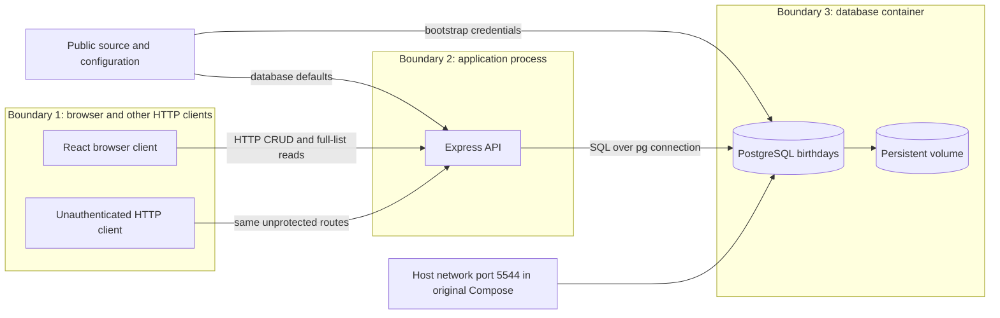
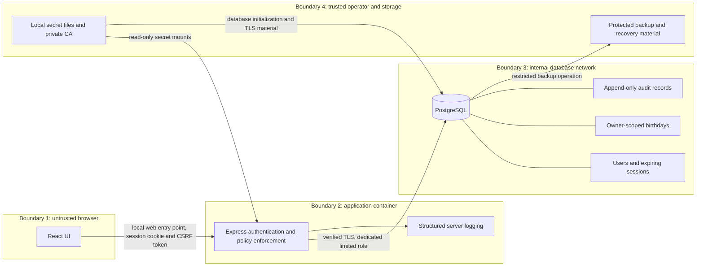

# Birthday Memory: threat model before remediation

Prepared September 21, 2026. Track B, Application Security.

**Status: design draft.** Source observations refer to upstream commit `849911eff1503f1aa25aa4a6fa3baa57b29ba41b`. Runtime tests and remediation verification are pending. This document does not assert that a planned control has been implemented.

**Implementation addendum (September 21, 2026):** The original design below is preserved as evidence of planning before code changes (commit `c146613`). Implemented controls and actual verification are now indexed in `verification.md`. The lab uses HTTP only on loopback, verified TLS to PostgreSQL, encrypted backups, and a concrete but unverified disk-encryption specification. This is not an ASVS certification or a production-readiness claim.

The application owner selected private lists: a user can read and manage only the birthday records they own. The original application has no concept of a user or record ownership. Adopting this policy therefore requires a schema change, API checks, and client behavior that respects the authenticated account.

## 1. Data flows and trust boundaries

### Original design

The original `app.listen(PORT)` does not explicitly restrict the listen address. Original Compose publishes `5544:5432` without a loopback address. The lab must override exposure to loopback before any startup; that safety override must be disclosed in baseline evidence. We will not test reachability from other machines.

### Proposed design

Transport for the local browser entry point must be explicitly documented. HTTP on loopback is a lab limitation, not evidence that a production deployment has HTTPS. If HTTPS is configured for the local app, its certificate verification must also be tested. Database TLS is mandatory and will use a private lab CA with hostname verification, not a global TLS-verification bypass.

## 2. STRIDE analysis across boundaries

STRIDE means Spoofing, Tampering, Repudiation, Information Disclosure, Denial of Service, and Elevation of Privilege.

| Boundary | STRIDE threats | Planned controls and proof |
|---|---|---|
| 1: client to API | Spoofing: no identity required. Tampering: unauthorized updates and deletes. Repudiation: no accountable actor. Disclosure: unrestricted lists. DoS: unrestricted repeated requests. Elevation: record identifiers confer access. | Require sessions; enforce owner filters in every read/write path; reject forged owner fields; durable audit events; rate limits and pagination. Test anonymous calls, account A/account B isolation, valid owner actions, bounded reads and controlled 429 responses. |
| 2: API to database | Spoofing: public default credentials and optional unverified TLS. Tampering/disclosure: excessive database grants. Repudiation: app can potentially alter its own evidence. DoS: unbounded result processing. Elevation: runtime schema creation implies more rights than normal CRUD. | Use secrets and verified TLS; separate migration and runtime roles; grant only required table/sequence operations; deny audit modification; cap queries. Test wrong CA, insufficient grants, session TLS status and app functionality. |
| 3: containers to host/runtime | Spoofing/tampering: mutable image tags and package supply chain. Disclosure: environment/volume access by trusted host operator. DoS: missing CPU/memory limits. Elevation: unnecessary privileges or root application process. Repudiation: insufficient operational logs. | Pin image digests; build non-root app image; drop capabilities; set no-new-privileges and resource limits; restrict networks and writable paths. Inspect actual runtime configuration, process identity, images, and health status. |
| 4: secrets, storage and backups | Spoofing/tampering: unauthorized operator or malicious secret replacement. Repudiation: unmanaged administrative changes. Disclosure: stolen disk/backup/key. DoS: lost backups or keys. Elevation: access to Docker daemon or host admin defeats container isolation. | Keep secrets out of Git/build context; specify and validate storage protection; separate keys and backup custody; document recovery and credential rotation. Treat host administrators as a residual trust dependency. |

Container controls reduce impact; they do not make a hostile host administrator safe. A database superuser can also defeat application ownership rules. These are explicit trust assumptions, not solved vulnerabilities.

## 3. Asset inventory

| Asset | Sensitivity | Location or flow | Protection requirement |
|---|---|---|---|
| Names, birthdates, phone numbers, email addresses | Personal data in a real deployment; fictional in this lab | Browser, API, database, backups | Enforce private ownership, minimize access and logs, protect transmission/storage and define retention |
| Account identifiers and password hashes | Authentication-sensitive | User table | Modern password hashing, restricted reads, no plaintext password logs |
| Session tokens and CSRF tokens | Active access credentials | Cookie/client memory and server-side session storage | Unpredictable tokens, bounded expiry, revocation, cookie restrictions, no token logging or Git commits |
| Database passwords and cryptographic keys | High sensitivity | Local protected files and secret mounts | Unique generated values, restricted access, separate key custody, documented rotation |
| Audit trail | Security-sensitive metadata | Persistent database audit table/log sink | Record actor/action/target/time; prevent runtime modification; omit PII payloads and tokens |
| Application source and dependency manifests | Public project; integrity-sensitive | Git and build context | Traceable commits, dependency/image scans, no real credentials |
| Backups | Same sensitivity as included data | Operator-controlled backup storage | Protected storage, restore exercise, access restrictions, retention and key recovery |
| Assessment artifacts | May accidentally contain credentials | `security/`, report PDF, public GitHub fork | Synthetic data only; redact secrets before commit; accurate timestamps and source references |

Regulatory applicability cannot be concluded from these data fields alone. The assignment provides no confirmed business location, customer locations, scale, covered-sector status, or payment processing. The report will explain conditional applicability using official sources and will not declare GDPR, CCPA/CPRA, HIPAA, PCI DSS, or a breach-notification duty applicable without the necessary facts.

## 4. Prioritized remediation roadmap

Priority below uses reachability, prerequisite privileges, confidentiality/integrity/availability consequences, and the number of records affected. It is provisional until runtime validation; these are not final CVSS scores.

| Order | Work | Why this priority | Evidence needed |
|---|---|---|---|
| 0 | Constrain the lab to loopback; use fictional data | Required before running deliberately vulnerable code | Compose rendering and actual published-port inspection |
| 1 | Add authentication and per-record ownership enforcement | The original routes expose all normal operations without identity; this is directly reachable through the intended API | Anonymous before/after CRUD; Bob denied access to Alice's records; Alice still succeeds |
| 2 | Replace default secrets, isolate database, separate runtime grants, verify TLS | A direct database connection or overprivileged app process can bypass the new API controls | Runtime grants, denied DDL/audit changes, no published DB port, rejected untrusted cert |
| 3 | Add durable auditing, validation, CORS/CSRF protection, bounded reads and rate limits | Make authorized sessions accountable and contain common abuse paths and resource costs | Log persistence, wrong types/fields, untrusted origin/CSRF tests, pagination, controlled throttling |
| 4 | Harden image and container settings; scan and inventory dependencies | Reduce supply-chain and process-compromise impact, while preserving functionality | Paired image/dependency scans, SBOM, non-root and limit inspection, health check |
| 5 | Complete storage and backup protection, recovery procedure, residual risk statement | Protect copies outside the API and make restoration credible | Implemented or precise specified at-rest controls, backup handling, restore proof where claimed |

Priority 1 outranks priority 2 because a caller can use the ordinary application interface without any credential. Database access has additional network or process prerequisites. Both must be addressed before a real release.

### Authentication design decision for review

Use a maintained session middleware with a PostgreSQL session store, a password hashing library, and a server-side idle/absolute expiry policy. A browser cookie will carry the session identifier, with HttpOnly and SameSite protection; mutating requests also need CSRF protection. Session renewal after login and server-side logout avoid leaving old sessions valid.

Server-side sessions fit this single web application and make logout/revocation straightforward. JWTs add key/refresh/revocation design work without a distributed-service need here. API keys suit service clients but are a poor primary login experience for individual people. Exact expiry values, password-hash cost, middleware, and session schema must be verified and documented during implementation.

### Important negative-test candidate

`routes.js` supplies external values through PostgreSQL query parameters. This is a reason to test SQL injection as a likely negative result, not to claim it is confirmed. Similarly, the generic error middleware already returns a generic message; the health route separately returns `error.message`. Report those behaviors separately after testing.

## Verification plan

Keep baseline and hardened evidence separate and pair tests by stable case ID. Each access-control fix needs a denied misuse case and an allowed legitimate case. Record actual requests/responses, timestamps, source commit, tool versions and limitations. Preserve full raw outputs in private working files if they contain secrets, and commit only verified redactions.

No scanner totals, runtime privilege levels, encrypted-storage claims, or final CVSS scores are asserted in this draft.
